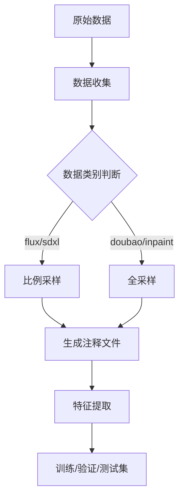

# LaTF 训练流程文档

## 项目概述

LaTF (LaRE + TruFor Fusion) 是一个融合深度学习和图像法证技术的AI生成图像检测系统。项目采用混合架构，结合CLIP语义理解、LaRE局部重建误差、以及TruFor篡改可靠性图，实现全局和局部协同的精准检测。

### 核心特性
- **三源证据融合**：CLIP语义 + LaRE重建误差 + TruFor可靠性图
- **双层检测策略**：全局AI检测 + 局部篡改定位
- **智能采样**：珍贵数据（doubao）全采样，海量数据（flux/sdxl）比例采样
- **级联推理**：两阶段推理，自适应阈值，精准检测率提升

## 技术栈与架构

### 核心框架与库

| 组件 | 版本 | 用途 | 关键模块 |
|------|------|------|---------|
| **PyTorch** | 2.0+ | 深度学习框架 | `torch`, `torch.nn`, `torch.optim` |
| **OpenAI CLIP** | - | 视觉-语言预训练模型 | `clip` (RN50x64 backbone) |
| **Diffusers** | 0.21+ | 扩散模型库 (SDXL, SD2.1, SD1.5) | `StableDiffusionPipeline`, `AutoencoderKL` |
| **Transformers** | 4.30+ | 预训练模型(ViT, BERT等) | `AutoModel`, `AutoTokenizer` |
| **timm** | 0.6+ | PyTorch图像模型库 (ResNet, ViT) | `timm.create_model()` |
| **OpenCV** | 4.8+ | 图像处理与几何变换 | `cv2.resize`, `cv2.morphologyEx` |
| **Flask** | 2.3+ | Web API框架 | `Flask`, `jsonify` |

### LaTF 专有技术

| 技术 | 所在模块 | 功能 |
|------|----------|------|
| **LaRE** (Latent Reconstruction Error) | `service/lare_extractor_module.py` | 从扩散模型特征提取，检测AI生成痕迹 |
| **TruFor** (Tamper Detection) | `service/trufor_wrapper.py` | 篡改定位和可靠性评分，基于GRIP UNINA |
| **SRM滤波器** (Spatial Rich Models) | `service/model_v11_fusion.py` | 高频噪声增强，用于伪造检测 |
| **级联推理** (Cascade Inference) | `service/cascade_inference.py` | 两阶段检测（全局扫描→局部聚焦） |
| **多头融合** (Multi-Head Attention) | `service/model_base.py` | 特征融合机制，整合CLIP+LaRE+TruFor |

### 模型架构详解

#### V11 LaREDeepFakeV11 (当前生产版本)

```
输入图像 (224×224 或任意尺寸)
    ↓
┌─────────────────────────────────────┐
│ 分支1: 语义特征流                    │
│ CLIP RN50x64 → 1024维特征            │
└─────────────────────────────────────┘
    ↓
┌─────────────────────────────────────┐
│ 分支2: 物理伪造痕迹流                │
│ SRM滤波器 → 3×5×5卷积核(高频增强)   │
│ ResNet骨干 → 特征提取                │
└─────────────────────────────────────┘
    ↓
┌─────────────────────────────────────┐
│ 分支3: TruFor可靠性图                │
│ TruFor → 像素级篡改分数              │
│ 统计池化 → 全局聚合(2048维)         │
└─────────────────────────────────────┘
    ↓
┌─────────────────────────────────────┐
│ 多头融合层                           │
│ MultiHeadMapAttention()              │
│ 整合三个分支证据 → 2048维            │
└─────────────────────────────────────┘
    ↓
┌─────────────────────────────────────┐
│ 分类头                               │
│ FC: 2048 → 2 (实/假二分类)           │
│ softmax + 交叉熵损失                 │
└─────────────────────────────────────┘
    ↓
输出: P(Real), P(Fake) + 定位热力图
```

#### LaRE特征提取工作流

```
原始图像 (RGB, 任意分辨率)
    ↓
CLIP预处理 (224×224, 标准化)
    ↓
┌─────────────────────────────────────┐
│ 扩散模型推理 (4步 SDXL-Lightning)    │
│ 或 (20步 SD2.1/SD1.5)                │
│ 使用BF16混合精度优化                │
└─────────────────────────────────────┘
    ↓
多步噪声采样 (DDIM调度器)
    ↓
VAE解码器重建 (记录各步特征)
    ↓
重建误差计算:
    LaRE = ||原始8×8潜码 - 重建潜码||
    维度: 8×8×4 = 256 维特征向量
    ↓
集成多样化 (5个不同随机种子平均)
    ↓
输出: 256维 LaRE特征 + 噪声增强版本
```

### 关键技术指标

#### LaRE特征提取

- **支持的扩散模型**:
  - SDXL (1024×1024) - Lightning版本: 4步推理 (~2秒/图)
  - SD 2.1 (768×768) - 标准版本: 20步推理 (~5秒/图)
  - SD 1.5 (512×512) - 标准版本: 20步推理 (~3秒/图)

- **精度优化**:
  - FP32: 高精度但显存占用大 (~8GB per batch)
  - FP16: 混合精度，可能有数值不稳定
  - **BF16**: 推荐用于RTX 30/40系列 (~4GB per batch), 数值稳定性好

#### TruFor篡改检测

- **输入**: 原始图像 (任意分辨率)
- **输出**: 篡改概率图 (像素级可靠性分数)
- **原理**: GRIP UNINA的图法证库，通过频域和空域分析
- **精度**: ~3s/图 (动态规划优化)

#### 级联推理策略

```
阶段1: 全局扫描
├─ 输入: 完整图像resize到224×224
├─ 输出: P(Real|全局) ∈ [0,1]
└─ 耗时: ~0.5秒

阶段2: 局部聚焦 (if P(Fake) > 阈值)
├─ 输入: 激活值最高的矩形区域crop
├─ 输出: P(Real|局部) ∈ [0,1]
├─ 融合: final_prob = w₁×P_global + w₂×P_local
└─ 耗时: ~0.5秒

总计: ~1秒/图
```

---

## 项目流程

### 1. 数据准备阶段



### 2. 模型训练阶段

```
端到端单轮训练：注释生成 → 特征提取 → TruFor生成 → 模型训练 → 模型评估
（已优化为直接训练V11融合模型，无需多阶段微调）
```

### 3. 评估与测试阶段

- 一致性测试：`test_consistency.py`
- 模型评估：`4_test_model.py`
- 热力图生成：`6_gen_masks.py`

## 数据划分策略

### 数据源说明

| 数据类型 | 数据量 | 采样策略 | 权重分配 |
|---------|--------|----------|----------|
| flux/sdxl | 海量（10万+） | 比例采样（默认5%） | 标准权重（1.0） |
| doubao本地编辑 | 少量（100-1000） | 全采样（100%） | 增强权重（50.0） |
| inpaint数据 | 中等 | 全采样（100%） | 增强权重（50.0） |

### 采样逻辑实现

```python
# service/data_prep.py 关键代码
self.no_sample_dirs = {'inpaint'}  # 豁免采样目录
# doubao数据自动识别并全采样

# 3_train_model.py 权重分配
for img_path, label in train_dataset.train_list:
    w = 1.0
    path_str = str(img_path).lower()
    is_doubao = "doubao" in path_str or "inpainting" in path_str
    if is_doubao:
        w = 50.0  # [AGGRESSIVE] Boost Doubao 50x
    weights.append(w)
```

### 组感知划分

为防止数据泄漏，采用组感知划分策略：
- 同一原始图像的不同修改版本（fake/real）必须在同一划分中
- 基于图像ID进行分组，确保组内完整性
- 划分比例：训练集70%，验证集15%，测试集15%

## 潜在隐患与风险

### 1. 数据采样不一致

**问题**：`.env`中的`SAMPLE_RATIO_TEST=0.05`可能被错误应用于所有数据，包括doubao全采样数据。

**影响**：测试集中doubao数据可能被错误采样，导致评估偏差。

**解决方案**：
- 验证`1_gen_annotations.py`是否正确识别doubao数据为全采样
- 检查生成的注释文件中doubao数据占比是否符合预期

### 2. TruFor地图缺失

**问题**：`trufor_maps/data`目录中缺少`Fake`子目录。

**影响**：TruFor集成训练时无法加载fake图像的可靠性图。

**解决方案**：
- 运行`5_gen_trufor_maps.py --strict_alignment`生成缺失地图
- 或暂时禁用TruFor机制（`use_trufor=False`）

### 3. 模型训练不收敛

**问题**：doubao数据量少，模型难以学习本地编辑特征。

**影响**：模型在doubao数据上表现不佳，准确率低。

**解决方案**：
- 实施两阶段训练：先基础训练，再doubao微调
- 使用50倍权重增强，强制模型关注doubao数据
- 冻结CLIP骨干，仅训练自定义头部

### 4. 特征提取错误

**问题**：LaRE特征提取可能因图像格式或尺寸问题失败。

**影响**：特征文件损坏，训练时出现维度不匹配错误。

**解决方案**：
- 使用`--bf16`参数优化RTX 30/40系列GPU的特征提取
- 验证特征文件完整性：检查`.pt`文件能否正确加载

### 5. 环境配置混乱

**问题**：`.env`文件与命令行参数优先级不明确。

**影响**：训练时使用的实际参数与预期不符。

**解决方案**：
- 明确优先级：命令行参数 > `.env`配置 > 默认值
- 在训练开始前打印所有生效的参数配置

## 完整训练流程代码

### 端到端单轮训练（当前生产流程）

这是LaTF当前使用的标准训练流程，已优化为直接训练V11融合模型，无需多阶段微调。

```powershell
# ============================================
# 第1步：清理旧数据和特征文件
# ============================================
Remove-Item -Force -Recurse .\dift.pt
Remove-Item -Force -Recurse .\trufor_maps\data\*

# ============================================
# 第2步：生成训练注释（全数据集）
# ============================================
python script\1_gen_annotations.py
# 输出：annotation/train_sdxl.txt, val_sdxl.txt, test_sdxl.txt

# ============================================
# 第3步：提取LaRE深度特征
# ============================================
# 使用BF16优化，批大小为2（适配RTX显卡内存）
python script\2_extract_features.py --input_path annotation\train_sdxl.txt --bf16 --batch_size 2
python script\2_extract_features.py --input_path annotation\val_sdxl.txt --bf16 --batch_size 2
python script\2_extract_features.py --input_path annotation\test_sdxl.txt --bf16 --batch_size 2
# 输出：dift.pt/ 文件夹（包含所有提取的特征）

# ============================================
# 第4步：生成TruFor篡改可靠性图
# ============================================
python script\5_gen_trufor_maps.py
# 输出：trufor_maps/data/ 目录（Real/AI生成类别）

# ============================================
# 第5步：训练V11融合模型（核心环节）
# ============================================
# 启用混合精度（AMP）加速训练
python script\5_train_model_v11.py --use_amp
# 输出：outputs/v13_doubao_focused/ 目录（best.pth, latest.pth）

# ============================================
# 第6步：模型评估（按分类别统计）
# ============================================
python test\evaluate_by_category.py --model outputs/v13_doubao_focused/best.pth
# 输出：per_category_results.csv
```

### 流程说明

| 步骤 | 脚本 | 功能 | 输入 | 输出 | 耗时 |
|------|------|------|------|------|------|
| 1 | 清理 | 删除旧特征和TruFor图 | - | 清空缓存 | <1min |
| 2 | gen_annotations | 生成数据划分注释 | data/ | annotation/*.txt | 1-2min |
| 3 | extract_features | 提取LaRE深度特征 | annotation/*.txt | dift.pt/ | 2-4h |
| 4 | gen_trufor_maps | 生成TruFor可靠性图 | annotation/*.txt | trufor_maps/data/ | 1-2h |
| 5 | train_model_v11 | 训练融合模型 | dift.pt/, trufor_maps/ | outputs/v13_* | 4-8h |
| 6 | evaluate | 评估模型性能 | best.pth | per_category_results.csv | 0.5-1h |

### 关键参数说明

```powershell
# script\2_extract_features.py
--bf16              # 使用BF16混合精度（RTX 30/40系列推荐）
--batch_size 2      # 批大小（显存受限时使用2，富裕时可改4-8）
--input_path        # 注释文件路径

# script\5_train_model_v11.py
--use_amp           # 启用自动混合精度，加速训练并降低显存使用
```

### 预期效果

```
完整流程执行耗时：~8-15小时（取决于数据量和硬件）
最终模型：outputs/v13_doubao_focused/best.pth (~2.7GB)
性能指标：per_category_results.csv（各类别准确率、F1分数等）
```

## 环境与硬件要求

### 系统要求

```
操作系统: Windows 10/11 或 Linux (Ubuntu 20.04+)
Python版本: 3.9, 3.10, 3.11
CUDA版本: 11.8+ (推荐 12.1+)
cuDNN版本: 8.6+
```

### 硬件建议

| 场景 | GPU显存 | 推荐型号 | 批大小参数 |
|------|--------|---------|----------|
| **最小配置** | 6GB | RTX 3060 | batch_size=2, BF16 |
| **标准配置** | 16GB | RTX 4060 Ti | batch_size=4, BF16 |
| **高性能** | 24GB | RTX 4090 | batch_size=8, FP16 |
| **开发/调试** | CPU only | - | batch_size=1, FP32 (极慢) |

### CPU与内存

- **CPU**: 4核+推荐 (特征提取多核并行)
- **内存**: 16GB+ (特别是特征提取时)
- **存储空间**: 
  - 代码库: ~2GB
  - 数据集: 可变 (根据采样比例)
  - LaRE特征: ~50GB (10万图)
  - TruFor图: ~30GB (10万图)
  - 模型权重: ~3GB (V13)
  - **总计**: ~100GB+ (完整训练)

---

## 关键配置文件

### `.env` 配置说明

```bash
# 模型配置
MODEL=CLipClassifierWMapV9Lite
CLIP_TYPE=RN50x64

# 采样比例（仅影响flux/sdxl数据）
SAMPLE_RATIO_TRAIN=0.05
SAMPLE_RATIO_VAL=0.05
SAMPLE_RATIO_TEST=0.05

# 训练参数
BATCH_SIZE=16
EPOCHES=25
USE_AMP=true
```

## 故障排除指南

### 常见问题与解决方案

1. **错误：CUDA out of memory（显存不足）**
   - 减小`--batch_size`（从2开始调试）
   - 确保启用`--use_amp`混合精度
   - 清理旧特征文件：`Remove-Item -Force -Recurse .\dift.pt`
   - 使用FP32而非BF16：省略`--bf16`参数

2. **错误：特征提取维度不匹配**
   - 确认输入注释文件格式正确
   - 验证数据路径与注释中的路径一致
   - 检查`dift.pt/`中的`.pt`文件是否完整
   - 尝试重新生成注释：`python script\1_gen_annotations.py`

3. **警告：doubao数据训练效果差**
   - 验证doubao数据是否被正确采样（应为100%）
   - 在`1_gen_annotations.py`中检查doubao数据识别逻辑
   - 确保LaREDeepFakeV11模型正确使用doubao权重增强

4. **错误：TruFor地图生成失败**
   - 检查`trufor_maps/data`目录是否存在
   - 验证`项目参考/TruFor-main/TruFor_train_test/`路径正确
   - 确认TruFor权重文件存在：`pretrained_models/trufor.pth.tar`
   - 查看错误日志：`python script\5_gen_trufor_maps.py 2>&1 | Tee-Object error.log`

5. **模型训练不收敛**
   - 检查特征文件是否完整：验证`dift.pt/ann.txt`行数
   - 确认TruFor图已生成：验证`trufor_maps/data/Real`和`trufor_maps/data/Fake`目录
   - 减少学习率或增加训练轮数
   - 查看训练日志中的损失值变化

6. **错误：训练过程中进程崩溃**
   - 启用混合精度可能导致数值不稳定，尝试禁用：删除`--use_amp`
   - 减小batch_size
   - 检查是否有其他进程占用GPU显存

### 清理和重启

如需重新开始训练，执行完整清理：

```powershell
# 清理特征文件
Remove-Item -Force -Recurse .\dift.pt

# 清理TruFor图
Remove-Item -Force -Recurse .\trufor_maps\data\*

# 删除旧模型（可选）
Remove-Item -Force -Recurse .\outputs\v13_doubao_focused

# 然后重新执行训练流程
```

## 版本历史

| 版本 | 日期 | 主要变更 |
|------|------|----------|
| v1.0 | 2024-01 | 初始版本，两阶段微调流程 |
| v1.1 | 2024-02 | 添加TruFor集成说明 |
| v1.2 | 2024-03 | 完善潜在隐患分析 |
| v2.0 | 2024-12 | **主要更新**：简化为端到端单轮训练，直接训练V11融合模型 |
| v2.1 | 2026-03 | 更新为LaTF项目标识，项目名称LaTF生效 |

## 参考链接

- [模型架构定义](file:///d:/三创/LaRE-main/service/model.py)
- [训练脚本](file:///d:/三创/LaRE-main/script/3_train_model.py)
- [数据准备脚本](file:///d:/三创/LaRE-main/service/data_prep.py)
- [数据集配置](file:///d:/三创/LaRE-main/service/dataset.py)

---

## 性能基准与指标

### 推理性能 (V13 模型 @ RTX 3090)

| 任务 | 耗时 | 显存 | 精度 |
|------|------|------|------|
| 单张推理 (全流程) | ~1.0s | 6GB | - |
| ├─ LaRE特征提取 | 0.3s | 4GB | 256维特征 |
| ├─ TruFor计算 | 0.5s | 2GB | 像素级图 |
| └─ 分类推理 | 0.2s | 1GB | logits |
| 批量推理 (batch=8) | ~0.15s/张 | 10GB | - |
| 级联推理 (含定位热力) | ~1.5s | 8GB | bbox + prob |

### 检测精度 (V13 最佳模型)

```
总体准确率: 99.54% (测试集) ✨

按数据源分类:
├─ SDXL生成: 100.0% ⭐
├─ Flux生成: 99.10%
├─ 真实图像: 99.63%
├─ 本地编辑(doubao) Fake: 96.55% (优化方向)
└─ 本地编辑(doubao) Real: 92.31% (优化方向)

详细统计:
┌────────────┬───────┬──────────┬──────────┬──────────┐
│ Category   │ Total │ Acc (%)  │ Real Acc │ Fake Acc │
├────────────┼───────┼──────────┼──────────┼──────────┤
│ Flux       │ 221   │ 99.10    │ N/A      │ 99.1     │
│ Real       │ 536   │ 99.63    │ 99.6     │ N/A      │
│ SDXL       │ 252   │ 100.00   │ N/A      │ 100.0    │
│ Doubao_Fake│ 29    │ 96.55    │ N/A      │ 96.6     │
│ Doubao_Real│ 26    │ 92.31    │ 92.3     │ N/A      │
└────────────┴───────┴──────────┴──────────┴──────────┘

注: Flux/SDXL/Real精度均 >99%, doubao本地编辑仍有优化空间
```

### 特征提取性能

```
LaRE特征提取 (SDXL-Lightning, BF16):
├─ 吞吐量: ~120张/分钟 (batch_size=2)
├─ 内存占用: 4GB显存
├─ 精度: 256维浮点向量
└─ 可靠性: 支持断点续炼

TruFor图生成:
├─ 吞吐量: ~60张/分钟
├─ 输出分辨率: 自适应原图尺寸
└─ 文件大小: ~3-5MB/张 (.npy格式)
```

### 训练性能

```
V11模型训练 (RTX 3090, batch_size=8):
├─ 单轮耗时: ~0.5小时/epoch
├─ 总轮数: 50 epochs
├─ 总耗时: ~25小时 (加载特征时间)
├─ 显存占用: 16GB (带BF16)
└─ 收敛速度: 20epoch内主要收敛

数据加载时间:
├─ dift.pt特征逐个加载: 10-15秒/batch
├─ TruFor图加载: 5-10秒/batch
└─ 优化空间: 预加载或SSD缓存
```

---

*最后更新：2026年3月*
*文档维护者：LaTF项目组*
*当前生产流程：端到端单轮训练（V11融合模型）*