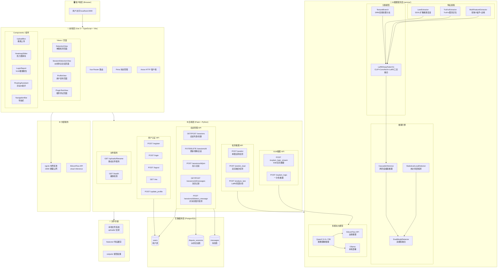
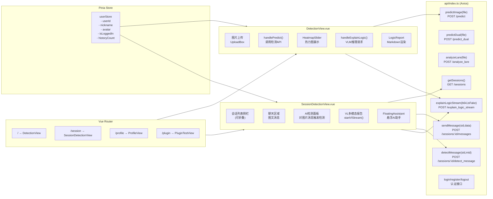
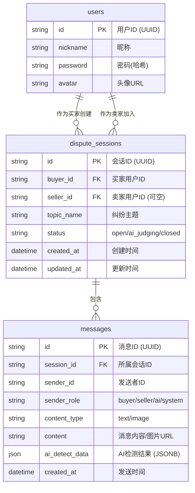
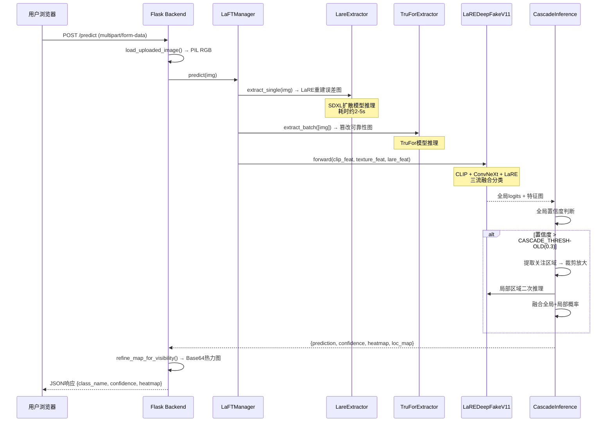
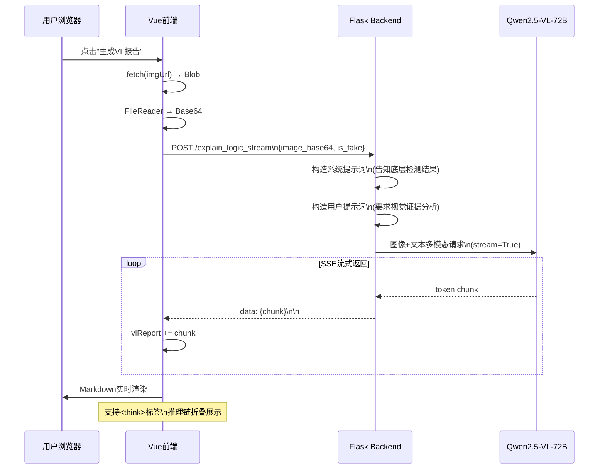
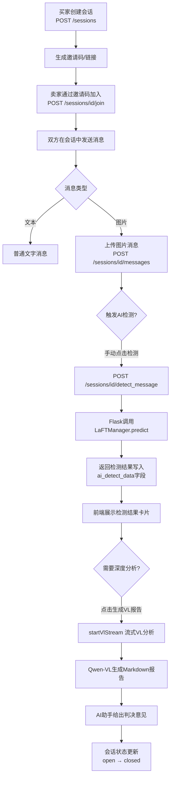
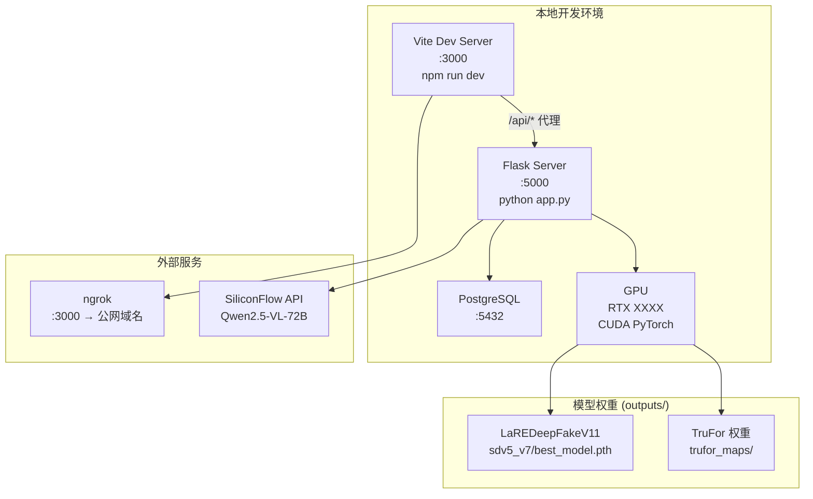

# LaRE 平台功能架构图

## 1. 整体架构总览

---

## 2. 前端详细架构

---

## 3. 后端 API 与数据库关系

---

## 4. AI推理数据流

---

## 5. VLM多模态推理流

---

## 6. 会话纠纷解决流程

---

## 7. 部署架构

---

## 8. 关键配置参数

| 参数 | 值 | 说明 |
|------|----|------|
| `AI_CONFIDENCE_THRESHOLD` | `0.5` | 最终真/假判断阈值 |
| `CASCADE_THRESHOLD` | `0.3` | 触发局部级联检测阈值 |
| `CROP_SIZE` | `224` | 局部裁剪尺寸 |
| `INPUT_SIZE` | `448` | 全局输入尺寸 |
| VLM 提供商 | SiliconFlow / Ollama | `.env` 配置 |
| 数据库 | PostgreSQL | `DATABASE_URL` 环境变量 |
| 前端端口 | `:3000` | Vite Dev Server |
| 后端端口 | `:5000` | Flask |
